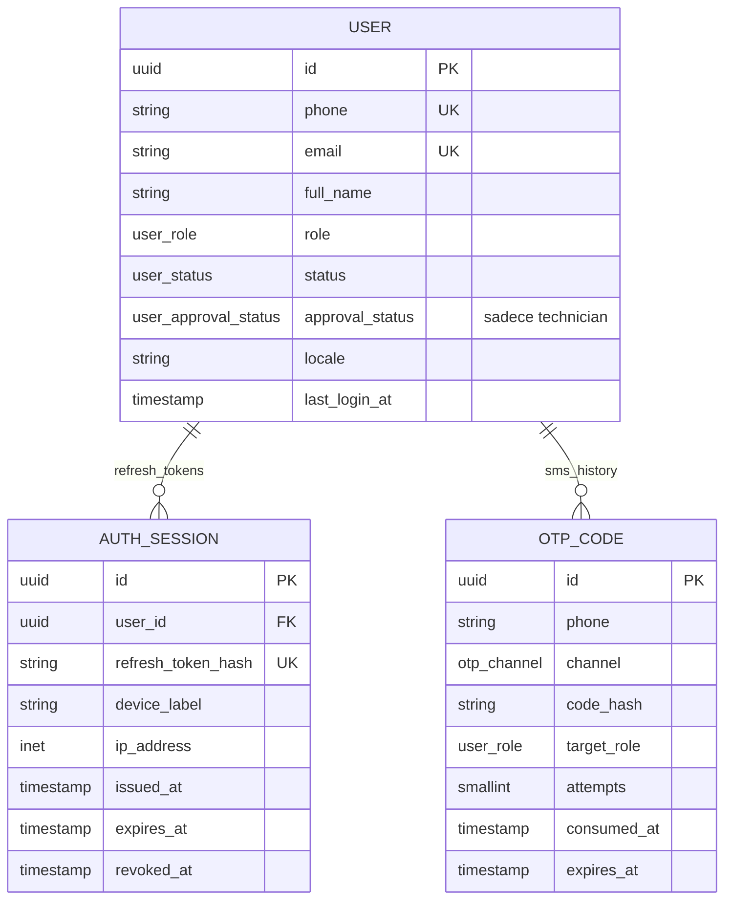

# 01 — Identity

## Purpose

Kullanıcı kimliği, kimlik doğrulama ve oturum yönetimi. Platformda üç rol var: **customer** (araç sahibi), **technician** (usta), **admin**. Tek `users` tablosu + role bazlı özellikler.

Auth akışı: **OTP (SMS) tabanlı** — kullanıcı telefon numarasını verir → OTP SMS → doğrulama → JWT (access + refresh) döner.

Teknisyenler için ek katman: `approval_status` — başvuran teknisyen admin onayı beklemede (`pending`), sonra `active` veya `suspended`.

## Entity tablolar

### `users`

```sql
CREATE TABLE users (
    id              UUID PRIMARY KEY DEFAULT gen_random_uuid(),
    phone           VARCHAR(32) UNIQUE,          -- E.164 (+905XXXXXXXXX)
    email           VARCHAR(255) UNIQUE,
    full_name       VARCHAR(255),
    role            user_role NOT NULL,
    status          user_status NOT NULL DEFAULT 'pending',
    approval_status user_approval_status,        -- sadece technician için
    locale          VARCHAR(10) NOT NULL DEFAULT 'tr-TR',
    last_login_at   TIMESTAMPTZ,
    deleted_at      TIMESTAMPTZ,
    created_at      TIMESTAMPTZ NOT NULL DEFAULT NOW(),
    updated_at      TIMESTAMPTZ NOT NULL DEFAULT NOW()
);

CREATE UNIQUE INDEX uq_users_phone ON users (phone) WHERE phone IS NOT NULL AND deleted_at IS NULL;
CREATE UNIQUE INDEX uq_users_email ON users (email) WHERE email IS NOT NULL AND deleted_at IS NULL;
CREATE INDEX ix_users_role_status ON users (role, status);
```

**Enum'lar**:
- `user_role` — `customer | technician | admin` (mevcut)
- `user_status` — `pending | active | suspended` (mevcut; genel hesap durumu)
- `user_approval_status` — `pending | active | suspended` **yeni**; sadece teknisyenler için KYC onay durumu

Not: `user_status` = genel hesap durumu (OTP verify sonrası `active`). `approval_status` = teknisyen-spesifik admin onayı (default `pending`, admin approve ile `active`).

### `auth_sessions`

Refresh token persistence + cihaz takibi.

```sql
CREATE TABLE auth_sessions (
    id                    UUID PRIMARY KEY DEFAULT gen_random_uuid(),
    user_id               UUID NOT NULL REFERENCES users(id) ON DELETE CASCADE,
    refresh_token_hash    VARCHAR(128) NOT NULL UNIQUE,   -- sha256 hash, ham token DB'de durmaz
    device_label          VARCHAR(255),                    -- "iPhone 15, Safari" vs.
    ip_address            INET,
    user_agent            VARCHAR(512),
    issued_at             TIMESTAMPTZ NOT NULL DEFAULT NOW(),
    expires_at            TIMESTAMPTZ NOT NULL,
    revoked_at            TIMESTAMPTZ,
    last_used_at          TIMESTAMPTZ,
    created_at            TIMESTAMPTZ NOT NULL DEFAULT NOW(),
    updated_at            TIMESTAMPTZ NOT NULL DEFAULT NOW()
);

CREATE INDEX ix_auth_sessions_user_id ON auth_sessions (user_id);
CREATE INDEX ix_auth_sessions_expires_at ON auth_sessions (expires_at) WHERE revoked_at IS NULL;
```

**Kurallar**:
- Refresh token ham değil, **sha256 hash** saklanır
- Revoke edilen token için `revoked_at` set; expire için `expires_at` geçince geçersiz
- Cleanup job (ARQ): `revoked_at < NOW() - INTERVAL '30 days'` olanları siler

### `otp_codes`

OTP rate limit + history.

```sql
CREATE TABLE otp_codes (
    id              UUID PRIMARY KEY DEFAULT gen_random_uuid(),
    phone           VARCHAR(32) NOT NULL,
    channel         otp_channel NOT NULL DEFAULT 'sms',
    code_hash       VARCHAR(128) NOT NULL,          -- sha256 hash
    target_role     user_role NOT NULL,              -- customer | technician | admin
    delivery_id     VARCHAR(128),                    -- Twilio vs provider reference
    attempts        SMALLINT NOT NULL DEFAULT 0,
    consumed_at     TIMESTAMPTZ,
    expires_at      TIMESTAMPTZ NOT NULL,
    created_at      TIMESTAMPTZ NOT NULL DEFAULT NOW()
);

CREATE INDEX ix_otp_codes_phone_created ON otp_codes (phone, created_at DESC);
CREATE INDEX ix_otp_codes_expires_active ON otp_codes (expires_at)
    WHERE consumed_at IS NULL;
```

**Enum'lar**:
- `otp_channel` — `sms | console | whatsapp` (console dev için)

**Kurallar**:
- OTP hash'lenir, ham kod DB'de durmaz
- `attempts` 3'ü geçerse invalidate
- Rate limit: son 1 dakikada aynı telefona max 1 OTP; son 1 saatte max 5
- Expire süresi: 5 dakika (config)
- Cleanup job: 30 gün sonra hard delete

## İlişkiler



## State makineleri

### `users.status`

```
pending → active → suspended
          ↑
          └─ (reactivate)
```

- `pending`: yeni hesap, OTP doğrulanmamış
- `active`: OTP doğrulandı, hesap kullanılabilir
- `suspended`: admin tarafından kapatıldı; login bloklu

### `users.approval_status` (sadece technician)

```
NULL (customer/admin) 
pending → active → suspended
      ↓
   rejected (tekrar pending'e dönebilir belge güncellemesiyle)
```

- Teknisyen hesabı ilk açıldığında `pending`
- Admin sertifikaları inceler → `active`
- Admin suspend ederse → `suspended` (havuz görünmez)
- `active` olmadan usta teklif gönderemez, randevu alamaz

## Lifecycle kuralları

- **Soft delete**: `users.deleted_at` — KVKK silme isteği; 30 gün sonra hard delete job
- **Cascade**: user silinirse `auth_sessions` cascade; ama `service_cases` RESTRICT (vaka geçmişi korunur — anonymize edilir)
- **Hard delete**: `otp_codes` 30 gün TTL ile; `auth_sessions` revoked 30 gün sonra

## Mobil ↔ Backend mapping

| Mobil (Zod) | Backend tablo/kolon |
|---|---|
| `UserSchema.id` | `users.id` |
| `UserSchema.phone` | `users.phone` |
| `UserSchema.email` | `users.email` |
| `UserSchema.full_name` | `users.full_name` |
| `UserSchema.role` | `users.role` |
| `UserSchema.status` | `users.status` |
| `UserSchema.created_at` | `users.created_at` (ISO string) |
| `ApprovalStatus` (naro-service-app runtime) | `users.approval_status` |
| `OtpRequestSchema.phone + channel + target_role` | `otp_codes` satırı |
| `TokenPairSchema.access_token` | JWT, **DB'de yok** (stateless) |
| `TokenPairSchema.refresh_token` | Ham döner; `auth_sessions.refresh_token_hash` saklanır |
| `RefreshRequestSchema.refresh_token` | Hash'lenir, `auth_sessions`'da aranır |

## İndeksler & sorgu pattern'leri

| Sorgu | Index |
|---|---|
| "Bu telefonla kullanıcı var mı?" | `uq_users_phone` |
| "Aktif teknisyenler listesi" | `ix_users_role_status` (role='technician', status='active') |
| "Pending onay bekleyen teknisyenler" (admin) | `(role, approval_status)` composite (opsiyonel) |
| "Bu telefona son 1 dakikada OTP gönderildi mi?" | `ix_otp_codes_phone_created` |
| "Kullanıcının aktif refresh token'ları" | `ix_auth_sessions_user_id` + `revoked_at IS NULL` |

## Test senaryoları

**Happy path**:
1. Yeni telefon → `otp_codes` oluşur → SMS gider
2. Kullanıcı OTP gönderir → hash match + expires_at kontrol → `consumed_at` set → `users` bulunur/oluşur (status=`active`)
3. JWT access + refresh token döner; `auth_sessions` kaydedilir

**Edge**:
1. OTP 3 kez yanlış → `attempts` artar, `consumed_at` set edilmez; 4. denemede reject
2. Expired OTP → 400 hata
3. Rate limit aşıldı (1 dakikada 2. SMS) → 429 hata
4. Aynı telefona aktif OTP varken yeni istek → eski invalidate + yeni
5. Refresh token revoke edildi → `revoked_at` set; sonraki refresh call 401
6. Teknisyen `approval_status=pending` iken login yapar → `access_token` döner ama `/havuz` endpoint'leri 403 (business rule)

## V2 scope (bu fazda yok)

- OAuth / sosyal login (Google, Apple) — `auth_sessions.provider` kolonu eklenir
- Multi-factor authentication (TOTP) — `users.mfa_secret`
- Device push token store — `auth_sessions.push_token` (notification fazı)
- Admin impersonation — ayrı `admin_sessions` tablosu
- GDPR data export — tüm user data bir zip

## Kod dosyaları (Faz 1 sonu)

- `naro-backend/app/models/user.py` — User modeli genişletilir (approval_status, locale, last_login_at, deleted_at)
- `naro-backend/app/models/auth.py` — AuthSession + OtpCode (yeni)
- `naro-backend/app/schemas/auth.py` — mevcut OTP/Token DTO'ları + SessionResponse
- `naro-backend/app/repositories/user.py` — mevcut, genişletilir
- `naro-backend/app/repositories/auth.py` — AuthSession + OtpCode query helpers (yeni)
- `naro-backend/alembic/versions/20260420_0002_identity.py` — users kolonları + auth_sessions + otp_codes
- `naro-backend/tests/test_auth.py` — happy + edge senaryoları
