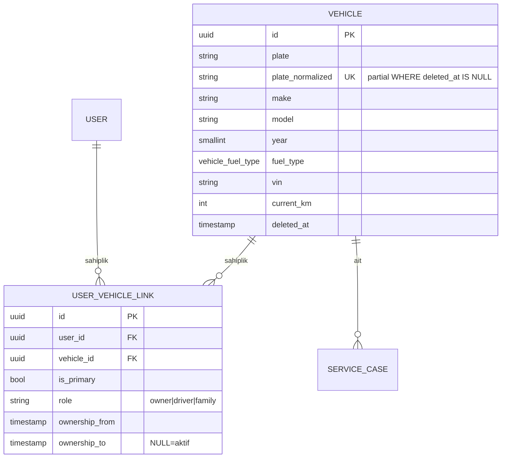

# 03 — Vehicle

## Purpose

Araç kimliği + müşteri-araç sahipliği. Her vaka bir araca bağlı, her araç potansiyel olarak birden fazla kullanıcıyla ilişkilendirilebilir (owner + family + driver). Vaka geçmişi bağlı olduğu için araç **soft delete**; sahiplik zamansal (owner geçmişi). Plaka normalize kolonu üzerinden eşsizlik + trgm arama.

**Zihin modeli**:
- `vehicles` = aracın kendisi (plaka, VIN, make/model, fiziksel özellikler)
- `user_vehicle_links` = sahiplik kaydı (rol + ownership_from/to) — tarihsel kayıt
- **Computed dossier** (mobil `trackingVehicleDirectory`) = ayrı tablo değil, join + count ile türetilir

## Entity tablolar

### `vehicles`

```sql
CREATE TABLE vehicles (
    id                UUID PRIMARY KEY DEFAULT gen_random_uuid(),
    plate             VARCHAR(32) NOT NULL,
    plate_normalized  VARCHAR(32) NOT NULL,           -- UPPER + no spaces
    make              VARCHAR(64),
    model             VARCHAR(128),
    year              SMALLINT,
    color             VARCHAR(64),
    fuel_type         vehicle_fuel_type,
    vin               VARCHAR(32),
    current_km        INTEGER,
    note              VARCHAR(500),
    deleted_at        TIMESTAMPTZ,
    created_at        TIMESTAMPTZ NOT NULL DEFAULT NOW(),
    updated_at        TIMESTAMPTZ NOT NULL DEFAULT NOW()
);
CREATE UNIQUE INDEX uq_vehicles_plate_normalized
  ON vehicles (plate_normalized) WHERE deleted_at IS NULL;
CREATE INDEX ix_vehicles_plate_trgm
  ON vehicles USING GIN (plate_normalized gin_trgm_ops);
CREATE INDEX ix_vehicles_vin ON vehicles (vin) WHERE vin IS NOT NULL;
```

**Enum**:
- `vehicle_fuel_type` — `petrol | diesel | lpg | electric | hybrid | other`

**Kurallar**:
- `plate_normalized = UPPER(REGEXP_REPLACE(plate, '\s+', '', 'g'))` — application-level (`_normalize_plate()` helper)
- Uniqueness **sadece aktif** (silinmiş plaka yeniden ekleme mümkün)
- VIN opsiyonel ama doluysa sorgulanır (SET NULL değil, partial index)
- Soft delete: KVKK silme isteği / araç satıldı

### `user_vehicle_links`

```sql
CREATE TABLE user_vehicle_links (
    id              UUID PRIMARY KEY DEFAULT gen_random_uuid(),
    user_id         UUID NOT NULL REFERENCES users(id) ON DELETE CASCADE,
    vehicle_id      UUID NOT NULL REFERENCES vehicles(id) ON DELETE CASCADE,
    is_primary      BOOLEAN NOT NULL DEFAULT FALSE,
    role            VARCHAR(16) NOT NULL DEFAULT 'owner'
                    CHECK (role IN ('owner','driver','family')),
    ownership_from  TIMESTAMPTZ NOT NULL DEFAULT NOW(),
    ownership_to    TIMESTAMPTZ,                       -- NULL = aktif
    created_at      TIMESTAMPTZ NOT NULL DEFAULT NOW(),
    CHECK (ownership_to IS NULL OR ownership_to > ownership_from)
);
-- Bir aracın aynı anda bir aktif sahibi (owner)
CREATE UNIQUE INDEX uq_active_owner_per_vehicle
  ON user_vehicle_links (vehicle_id)
  WHERE ownership_to IS NULL AND role = 'owner';
CREATE INDEX ix_user_vehicle_active
  ON user_vehicle_links (user_id, ownership_to);
```

**Kurallar**:
- `role='owner'` → 1 aracın 1 anda 1 aktif sahibi (partial unique)
- `role='driver'` / `'family'` → sınırsız (aile üyesi, sürücü)
- Sahiplik transferi: `transfer_ownership()` transaction
  1. eski owner link'inin `ownership_to = NOW()` set
  2. yeni link: `role='owner'`, `ownership_from=NOW()`, `ownership_to=NULL`
- `is_primary` kullanıcının default aracını işaretler (UI switcher için)

## İlişkiler



## Computed dossier (mobil `trackingVehicleDirectory`)

Backend **kolon olarak tutmaz**, repository'de join/count ile döner:

```python
async def vehicle_dossier(session, vehicle_id: UUID) -> VehicleDossierView:
    return {
        "vehicle": <vehicles row>,
        "primary_owner": <users row via active owner link>,
        "additional_drivers": [<users row via role IN ('driver','family')>],
        "previous_case_count": count(service_cases WHERE vehicle_id=?),
        "last_case": <service_cases row ORDER BY updated_at DESC LIMIT 1>,
    }
```

Faz 4 `service_cases` geldikten sonra join çalışır; Faz 3 boyunca stub döner.

## Lifecycle kuralları

- **Create**: `create_vehicle(plate, owner_user_id, ...)` → vehicles + link (role=owner, is_primary=true) tek transaction
- **Transfer**: eski owner link ownership_to set + yeni owner link
- **Soft delete**: `vehicles.deleted_at` → plaka uniqueness serbestleşir, case'ler RESTRICT ile erişilebilir kalır
- **Cascade**:
  - User silinirse link CASCADE düşer; araç kalır (başkası owner olabilir)
  - Vehicle silinirse link CASCADE; case RESTRICT (vaka geçmişi korunur — Faz 4)
- **Plaka güncelleme**: aynı araç kaydında plaka değiştirilir (eski plaka uniqueness'tan düşer çünkü satır aynı)

## Mobil ↔ Backend mapping

| Mobil (`VehicleSchema`) | Backend tablo/kolon |
|---|---|
| `id`, `plate` | `vehicles.id`, `vehicles.plate` |
| `make`, `model`, `year`, `color` | top-level |
| `fuel` | `vehicles.fuel_type` (enum'a map; free-text → enum mapper) |
| `mileageKm` | `vehicles.current_km` |
| `note` | top-level |
| `isActive` | UI state (`is_primary` üzerinden türetilir veya user tercih store'u) |
| `tabThumbnailUri` | avatar yerine `media_asset` (V2) |
| `history[]` (VehicleMemoryEvent) | computed — `service_cases` + `case_events` (Faz 4/12) |
| `warranties[]`, `maintenanceReminders[]` | **ayrı tablo V2**; şimdilik computed / static fixtures |
| `healthLabel`, `lastServiceLabel`, `nextServiceLabel` | computed (UI tarafı) |
| `regularShop` | V2: tercih edilen usta referansı |
| `historyAccessGranted` | `user_vehicle_links.role='owner'` + custom flag (V2) |
| `chronicNotes[]` | `vehicles.note` veya ayrı tablo (V2) |

## İndeksler & sorgu pattern'leri

| Sorgu | Index |
|---|---|
| "Bu plakaya araç var mı?" | `uq_vehicles_plate_normalized` |
| "Plaka arama: 34 ABC" | `ix_vehicles_plate_trgm` |
| "VIN ile arama" (servis dosyası) | `ix_vehicles_vin` |
| "Kullanıcının aktif araçları" | `ix_user_vehicle_active` (user_id, ownership_to IS NULL) |
| "Bu aracın aktif sahibi" | `uq_active_owner_per_vehicle` |

## Test senaryoları

**Happy path**:
1. `create_vehicle(plate='34 ABC 42', make='BMW', owner=user1)` → vehicles + link
2. `find_vehicle_by_plate('34abc42')` → eşleşir (normalize)
3. `list_vehicles_for_user(user1)` → 1 araç
4. `transfer_ownership(vehicle, user1, user2)` → eski link ownership_to set, yeni link aktif

**Edge**:
1. Duplicate plaka `'34ABC42'` → unique violation
2. Soft delete + yeni `34ABC42` → başarılı (partial unique)
3. Aynı araca 2 driver eklenebilir; 2. owner → partial unique ihlali
4. `vehicle_dossier(id)` → boş case listesi döner (Faz 4 öncesi)
5. Plaka trgm arama: "ABC" → "34 ABC 42" eşleşir
6. `ownership_to <= ownership_from` → CHECK violation
7. User delete → link CASCADE; vehicle kalır

## V2 scope (bu fazda yok)

- **Warranty / maintenance reminder tabloları** → V2
- **Vehicle preferred shop** (regularShop) → V2
- **Vehicle history (VehicleMemoryEvent)** → Faz 12 case_events'ten türetilir
- **Araç görsel avatar** (tabThumbnailUri) → `vehicles.avatar_asset_id` V2
- **Plate number fraud detection** (plaka + VIN uyuşmazlığı) → V2

## Kod dosyaları (Faz 3 sonu)

- `naro-backend/app/models/vehicle.py` — Vehicle + UserVehicleLink + enum
- `naro-backend/app/schemas/vehicle.py` — Pydantic in/out
- `naro-backend/app/repositories/vehicle.py` — CRUD + dossier helper
- `naro-backend/alembic/versions/20260420_0004_vehicle.py` — 1 enum + 2 tablo
- `naro-backend/tests/test_vehicle.py` — 6 senaryo
