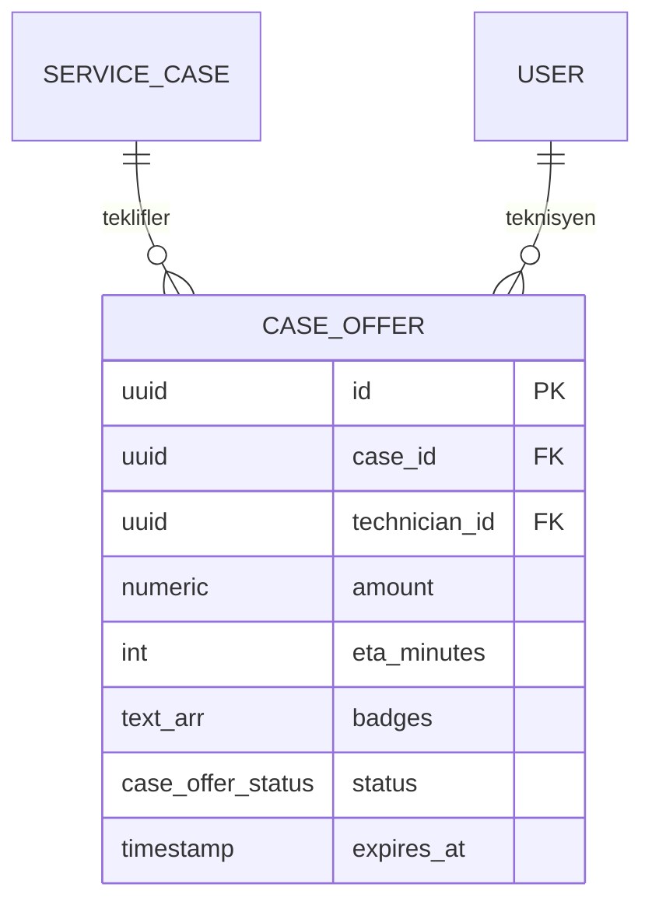

# 05 — Case Offer

## Purpose

Usta'nın bir vakaya gönderdiği **teklif**. Müşteri aktif teklifler arasından birini seçer → randevu talebine dönüşür. Rekabet politikası: (case, technician) başına aynı anda yalnızca 1 aktif teklif (pending/shortlisted/accepted).

## Entity

### `case_offers`

```sql
CREATE TABLE case_offers (
    id                 UUID PRIMARY KEY DEFAULT gen_random_uuid(),
    case_id            UUID NOT NULL REFERENCES service_cases(id) ON DELETE CASCADE,
    technician_id      UUID NOT NULL REFERENCES users(id) ON DELETE CASCADE,

    headline           VARCHAR(255) NOT NULL,
    description        TEXT,
    amount             NUMERIC(12,2) NOT NULL CHECK (amount >= 0),
    currency           VARCHAR(8) NOT NULL DEFAULT 'TRY',
    eta_minutes        INTEGER NOT NULL CHECK (eta_minutes >= 0),
    delivery_mode      VARCHAR(64) NOT NULL,
    warranty_label     VARCHAR(128) NOT NULL,
    available_at_label VARCHAR(128),
    badges             TEXT[] NOT NULL DEFAULT '{}',

    -- Faz 6: firm slot pattern (Kural 4) — B akışı
    slot_proposal      JSONB,                      -- {kind, dateLabel, timeWindow}
    slot_is_firm       BOOLEAN NOT NULL DEFAULT FALSE,
    CHECK (NOT slot_is_firm OR slot_proposal IS NOT NULL),

    status             case_offer_status NOT NULL DEFAULT 'pending',
    submitted_at       TIMESTAMPTZ NOT NULL DEFAULT NOW(),
    accepted_at        TIMESTAMPTZ,
    rejected_at        TIMESTAMPTZ,
    expires_at         TIMESTAMPTZ,
    created_at         TIMESTAMPTZ NOT NULL DEFAULT NOW(),
    updated_at         TIMESTAMPTZ NOT NULL DEFAULT NOW()
);

CREATE UNIQUE INDEX uq_active_offer_per_tech_case
  ON case_offers (case_id, technician_id)
  WHERE status IN ('pending','shortlisted','accepted');

CREATE INDEX ix_case_offers_case ON case_offers (case_id, status, amount);
CREATE INDEX ix_case_offers_tech ON case_offers (technician_id, status, submitted_at DESC);
CREATE INDEX ix_case_offers_expiring ON case_offers (expires_at)
  WHERE status = 'pending' AND expires_at IS NOT NULL;
```

### Enum

```sql
CREATE TYPE case_offer_status AS ENUM
  ('pending','shortlisted','accepted','rejected','expired','withdrawn');
```

## State makinesi (Faz 6 revize)

```
pending ──┬─ shortlisted (müşteri önizledi)
          ├─ accepted ──┬─ (slot_is_firm=true)  → appointment auto-create (approved) → case=scheduled
          │             └─ (slot_is_firm=false) → case=appointment_pending (müşteri sonra randevu talep eder)
          ├─ rejected    (müşteri reddetti)
          ├─ withdrawn   (usta iptal etti)
          └─ expired     (TTL)
```

**Atomic `accept_offer`** service (Faz 6'da dallanmalı):
1. `offer.status='accepted'` + `accepted_at=NOW()`
2. Aynı case'teki diğer pending/shortlisted → `rejected` + `rejected_at`
3. Dallanma:
   - `slot_is_firm=False` → `case.status='appointment_pending'` (Kural 3 — A akışı)
   - `slot_is_firm=True` → `appointment` auto-create (source='offer_accept', status='approved') + `case.status='scheduled'` + `assigned_technician_id` set (Kural 4 — B akışı)

## İlişkiler



## Mobil ↔ Backend mapping

| Mobil (`CaseOfferSchema`) | Backend |
|---|---|
| `headline`, `description`, `amount`, `currency`, `eta_minutes`, `delivery_mode`, `warranty_label`, `available_at_label`, `badges`, `status` | top-level |
| `.price_label` | computed (`amount + currency`) |
| `.eta_label` | computed (`eta_minutes`) |

## Repository helpers

```python
submit_offer(case_id, technician_id, amount, eta_minutes, headline, description,
             delivery_mode, warranty_label, badges=None, expires_at=None) -> CaseOffer
withdraw_offer(offer_id, *, technician_id)
accept_offer(offer_id) -> CaseOffer   # triggers case transition
reject_offer(offer_id)
list_offers_for_case(case_id) -> list[CaseOffer]
my_offer_for_case(case_id, technician_id) -> CaseOffer | None
list_offers_for_technician(technician_id, status_in=None) -> list[CaseOffer]
expire_stale_offers() -> int  # cron: pending + expires_at <= NOW
```

## Test senaryoları

1. Submit → DB row; amount/eta CHECK enforced (negative amount fails)
2. Duplicate active (same case/tech) → partial unique violation
3. Withdraw → status='withdrawn', uniqueness serbest, re-offer mümkün
4. `accept_offer` atomic: kendi accepted, kardeşler rejected, case→appointment_pending
5. Cron expire: pending + past expires_at → status='expired'
6. Cascade: case delete → offers CASCADE; technician delete → offers CASCADE

## V2 (bu fazda yok)

- Karşı-teklif / pazarlama (counter offer)
- Offer amount edit (şu an withdraw + re-offer)
- Offer attachments (parça resimi, belge)
