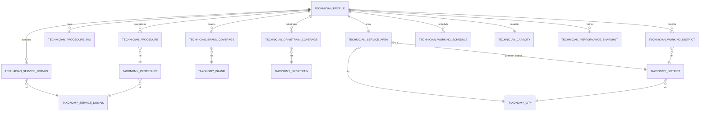

# 16 — Technician Sinyal Modeli (V2)

## Purpose

[02-technician.md](02-technician.md) V1 usta veri modelini tanımlar: `technician_profiles`, `technician_capabilities`, `technician_specialties` (serbest metin), `technician_certificates`, `technician_gallery_items`. V1 yeterince ama matching motoru için sinyal kalitesi zayıf:

- `technician_specialties` serbest metin kovası (marka + kategori + işlem karışmış)
- `working_hours` VARCHAR (structured schedule yok → slot sorgusu imkansız)
- `area_label` VARCHAR (lat/lng yok → mesafe/radius hesaplanamaz)
- Marka/model coverage yapılandırılmamış
- Kapasite (staff, concurrency) yok
- Performance rolling aggregation yok

Bu doküman V2 genişletmeyi tanımlar. [docs/sinyal-hiyerarsi-mimari.md](../sinyal-hiyerarsi-mimari.md)'deki 7-boyutlu hiyerarşinin backend karşılığıdır.

**Zihin modeli:** V1 tabloları (`technician_profiles`, `technician_capabilities`, `technician_certificates`, `technician_gallery_items`) aynen kalır. V1'deki `technician_specialties` **deprecated** (soft), yeni sinyal tablolarıyla ikame edilir. Ek olarak master taxonomy tabloları + 9 yeni profil eklenti tablosu + 1 aggregation tablosu eklenir.

## Yeni tablolar — özet

| Tablo | Amaç | Boyut |
|---|---|---|
| `taxonomy_service_domains` | Master: Motor/Fren/Elektrik... | Sinyal Hiyerarşisi boyut 1 L1 |
| `taxonomy_procedures` | Master: zamanlama_kiti, turbo_rebuild... | Boyut 1 L2 |
| `taxonomy_brands` | Master: BMW, TOFAŞ... + tier | Boyut 2 L0-L1 |
| `taxonomy_cities` + `taxonomy_districts` | Master: TR idari | Boyut 3 L0 |
| `taxonomy_drivetrains` | Master: benzin_otomatik... | Boyut 2 L3 |
| `technician_service_domains` | Usta → domain çok-çok | Boyut 1 L1 |
| `technician_procedures` | Usta → procedure çok-çok | Boyut 1 L2 |
| `technician_procedure_tags` | Usta → serbest etiket (embedding) | Boyut 1 L3 |
| `technician_brand_coverage` | Usta → brand çok-çok + yetkili flag | Boyut 2 L1 |
| `technician_drivetrain_coverage` | Usta → drivetrain çok-çok | Boyut 2 L3 |
| `technician_service_area` | 1:1 — workshop_lat_lng + radius | Boyut 3 L1-L2 |
| `technician_working_districts` | Usta → district çok-çok | Boyut 3 L3 |
| `technician_working_schedule` | Haftalık slot grid | Boyut 4 L1 |
| `technician_capacity` | 1:1 — staff, concurrency, flags | Boyut 4 L2-L3 |
| `technician_performance_snapshots` | Rolling aggregation | Boyut 5 L3 |

## Master taxonomy tabloları

### `taxonomy_service_domains`

```sql
CREATE TABLE taxonomy_service_domains (
    domain_key   VARCHAR(40) PRIMARY KEY,
    label        VARCHAR(120) NOT NULL,
    description  TEXT,
    icon         VARCHAR(40),
    display_order SMALLINT NOT NULL DEFAULT 0,
    is_active    BOOLEAN NOT NULL DEFAULT TRUE,
    created_at   TIMESTAMPTZ NOT NULL DEFAULT NOW()
);
```

**Seed** (~12 satır): `motor`, `sanziman`, `fren`, `suspansiyon`, `elektrik`, `klima`, `lastik`, `kaporta`, `cam`, `aku`, `aksesuar`, `cekici`.

### `taxonomy_procedures`

```sql
CREATE TABLE taxonomy_procedures (
    procedure_key            VARCHAR(60) PRIMARY KEY,
    domain_key               VARCHAR(40) NOT NULL REFERENCES taxonomy_service_domains(domain_key),
    label                    VARCHAR(160) NOT NULL,
    description              TEXT,
    typical_labor_hours_min  NUMERIC(5,2),
    typical_labor_hours_max  NUMERIC(5,2),
    typical_parts_cost_min   NUMERIC(10,2),
    typical_parts_cost_max   NUMERIC(10,2),
    is_popular               BOOLEAN NOT NULL DEFAULT FALSE,
    display_order            SMALLINT NOT NULL DEFAULT 0,
    is_active                BOOLEAN NOT NULL DEFAULT TRUE,
    created_at               TIMESTAMPTZ NOT NULL DEFAULT NOW()
);
CREATE INDEX ix_taxonomy_procedures_domain ON taxonomy_procedures (domain_key, is_active);
CREATE INDEX ix_taxonomy_procedures_popular ON taxonomy_procedures (domain_key, is_popular, display_order);
```

**Seed** (~60 satır): Domain başına ~5-10 procedure. Örn. `motor` → `zamanlama_kiti`, `turbo_rebuild`, `kafa_contasi`, `valf_ayari`, `yag_bakimi`, `oem_izleme_teshisi`, `motor_revizyon`.

**Kurallar:**
- `typical_*` alanları AI quote comparator için referans fiyat/süre bandı. Null olabilir (seed zamanı).
- `is_popular=true` → UI'da domain içinde önde gösterilir.

### `taxonomy_brands`

```sql
CREATE TABLE taxonomy_brands (
    brand_key     VARCHAR(40) PRIMARY KEY,
    label         VARCHAR(120) NOT NULL,
    tier          brand_tier NOT NULL DEFAULT 'mass',
    country_code  CHAR(2),
    display_order SMALLINT NOT NULL DEFAULT 0,
    is_active     BOOLEAN NOT NULL DEFAULT TRUE,
    created_at    TIMESTAMPTZ NOT NULL DEFAULT NOW()
);

CREATE TYPE brand_tier AS ENUM ('mass','premium','luxury','commercial','motorcycle');
```

**Seed** (~40 satır): `bmw`(premium), `mercedes`(premium), `audi`(premium), `porsche`(luxury), `bentley`(luxury), `tofas_fiat`(mass), `renault`(mass), `volkswagen`(mass/premium), `hyundai`(mass), `toyota`(mass), `ford`(mass/commercial), `ducati`(motorcycle)...

### `taxonomy_cities`

```sql
CREATE TABLE taxonomy_cities (
    city_code    VARCHAR(8) PRIMARY KEY,   -- "34" (plaka kodu)
    label        VARCHAR(80) NOT NULL,
    region       VARCHAR(40),
    is_active    BOOLEAN NOT NULL DEFAULT TRUE
);
```

**Seed:** 81 il (resmi T.C. idari). Başlangıç migration'da.

### `taxonomy_districts`

```sql
CREATE TABLE taxonomy_districts (
    district_id  UUID PRIMARY KEY DEFAULT gen_random_uuid(),
    city_code    VARCHAR(8) NOT NULL REFERENCES taxonomy_cities(city_code),
    label        VARCHAR(80) NOT NULL,
    center_lat   NUMERIC(9,6),
    center_lng   NUMERIC(9,6),
    is_active    BOOLEAN NOT NULL DEFAULT TRUE,
    UNIQUE (city_code, label)
);
CREATE INDEX ix_districts_city ON taxonomy_districts (city_code, is_active);
```

**Seed:** İstanbul + Ankara + İzmir ilçeleri V1. Diğer iller iterasyon sonrası.

### `taxonomy_drivetrains`

```sql
CREATE TABLE taxonomy_drivetrains (
    drivetrain_key  VARCHAR(40) PRIMARY KEY,
    label           VARCHAR(80) NOT NULL,
    fuel_type       VARCHAR(20) NOT NULL,   -- benzin|dizel|hibrit|ev|lpg|cng
    transmission    VARCHAR(20),            -- otomatik|manuel|dsg|cvt
    display_order   SMALLINT NOT NULL DEFAULT 0
);
```

**Seed** (~9): `benzin_otomatik`, `benzin_manuel`, `dizel_otomatik`, `dizel_manuel`, `hibrit`, `ev`, `lpg_donusumlu`, `cng_donusumlu`, `motosiklet`.

## Usta sinyal tabloları

### `technician_service_domains` (çok-çok)

```sql
CREATE TABLE technician_service_domains (
    profile_id   UUID NOT NULL REFERENCES technician_profiles(id) ON DELETE CASCADE,
    domain_key   VARCHAR(40) NOT NULL REFERENCES taxonomy_service_domains(domain_key),
    created_at   TIMESTAMPTZ NOT NULL DEFAULT NOW(),
    PRIMARY KEY (profile_id, domain_key)
);
CREATE INDEX ix_tech_domains_domain ON technician_service_domains (domain_key, profile_id);
```

### `technician_procedures` (çok-çok + confidence)

```sql
CREATE TABLE technician_procedures (
    profile_id                UUID NOT NULL REFERENCES technician_profiles(id) ON DELETE CASCADE,
    procedure_key             VARCHAR(60) NOT NULL REFERENCES taxonomy_procedures(procedure_key),
    confidence_self_declared  NUMERIC(3,2) NOT NULL DEFAULT 1.00,
    confidence_verified       NUMERIC(3,2),  -- NULL = henüz verify edilmemiş
    completed_count           INT NOT NULL DEFAULT 0,
    created_at                TIMESTAMPTZ NOT NULL DEFAULT NOW(),
    PRIMARY KEY (profile_id, procedure_key)
);
CREATE INDEX ix_tech_procedures_procedure ON technician_procedures (procedure_key, profile_id);
```

**Kurallar:**
- `confidence_self_declared` default 1.00 (beyan). Usta "uzmanıyım" dese de matching'de zayıf ağırlıkla girer.
- `confidence_verified` AI + completed job history ile üretilir (V2 job). İşlem kadrosu büyüdükçe confidence yükselir.
- `completed_count` snapshot job ile güncellenir (rolling 90g).

### `technician_procedure_tags`

```sql
CREATE TABLE technician_procedure_tags (
    id           UUID PRIMARY KEY DEFAULT gen_random_uuid(),
    profile_id   UUID NOT NULL REFERENCES technician_profiles(id) ON DELETE CASCADE,
    tag          VARCHAR(120) NOT NULL,
    tag_normalized VARCHAR(120) NOT NULL,
    embedding    VECTOR(384),  -- pgvector (opsiyonel, V2 için)
    created_at   TIMESTAMPTZ NOT NULL DEFAULT NOW(),
    UNIQUE (profile_id, tag_normalized)
);
CREATE INDEX ix_tech_tags_search ON technician_procedure_tags USING GIN (tag_normalized gin_trgm_ops);
-- V2: CREATE INDEX ix_tech_tags_embedding ON technician_procedure_tags USING ivfflat (embedding vector_cosine_ops);
```

**Kurallar:**
- `tag_normalized` = lower+trim. Duplicate engellenir.
- `embedding` pgvector — V2'de AI intake vektörüyle cosine eşleştirme için. V1'de null.

### `technician_brand_coverage`

```sql
CREATE TABLE technician_brand_coverage (
    profile_id              UUID NOT NULL REFERENCES technician_profiles(id) ON DELETE CASCADE,
    brand_key               VARCHAR(40) NOT NULL REFERENCES taxonomy_brands(brand_key),
    is_authorized           BOOLEAN NOT NULL DEFAULT FALSE,
    is_premium_authorized   BOOLEAN NOT NULL DEFAULT FALSE,
    notes                   TEXT,
    created_at              TIMESTAMPTZ NOT NULL DEFAULT NOW(),
    PRIMARY KEY (profile_id, brand_key)
);
CREATE INDEX ix_tech_brands_brand ON technician_brand_coverage (brand_key, profile_id);
CREATE INDEX ix_tech_brands_authorized ON technician_brand_coverage (profile_id) WHERE is_authorized = TRUE;
```

**Kurallar:**
- Boş (hiç row yok) → wildcard ("tümü"). Matching'de hard filter uygulanmaz.
- `is_authorized=true` → OEM yetkili servis (sertifika ile doğrulanmalı).
- `is_premium_authorized=true` → premium/luxury tier brand için özel yetki.

### `technician_drivetrain_coverage`

```sql
CREATE TABLE technician_drivetrain_coverage (
    profile_id      UUID NOT NULL REFERENCES technician_profiles(id) ON DELETE CASCADE,
    drivetrain_key  VARCHAR(40) NOT NULL REFERENCES taxonomy_drivetrains(drivetrain_key),
    created_at      TIMESTAMPTZ NOT NULL DEFAULT NOW(),
    PRIMARY KEY (profile_id, drivetrain_key)
);
```

Boş → wildcard ("tümü").

### `technician_service_area` (1:1)

```sql
CREATE TABLE technician_service_area (
    profile_id          UUID PRIMARY KEY REFERENCES technician_profiles(id) ON DELETE CASCADE,
    workshop_lat        NUMERIC(9,6) NOT NULL,
    workshop_lng        NUMERIC(9,6) NOT NULL,
    service_radius_km   INT NOT NULL DEFAULT 15 CHECK (service_radius_km BETWEEN 1 AND 500),
    city_code           VARCHAR(8) NOT NULL REFERENCES taxonomy_cities(city_code),
    primary_district_id UUID REFERENCES taxonomy_districts(district_id),
    mobile_unit_count   SMALLINT NOT NULL DEFAULT 0,
    workshop_address    TEXT,  -- reverse geocode cache
    updated_at          TIMESTAMPTZ NOT NULL DEFAULT NOW()
);
CREATE INDEX ix_tech_area_city ON technician_service_area (city_code);
CREATE INDEX ix_tech_area_geo ON technician_service_area USING GIST (
    circle(point(workshop_lng, workshop_lat), service_radius_km / 111.0)
);
```

**Kurallar:**
- `GIST + circle` index → vaka lat/lng verildiğinde "bu konumu kapsayan ustalar" O(log n) sorgusu. `111.0` ≈ 1 derece enlem km.
- `mobile_unit_count` çekici için canlı araç sayısı (ileri iterasyon: `technician_mobile_units` tablosu ile genişler — lat/lng stream).

### `technician_working_districts`

```sql
CREATE TABLE technician_working_districts (
    profile_id    UUID NOT NULL REFERENCES technician_profiles(id) ON DELETE CASCADE,
    district_id   UUID NOT NULL REFERENCES taxonomy_districts(district_id),
    is_auto_suggested BOOLEAN NOT NULL DEFAULT FALSE,
    created_at    TIMESTAMPTZ NOT NULL DEFAULT NOW(),
    PRIMARY KEY (profile_id, district_id)
);
CREATE INDEX ix_tech_districts_district ON technician_working_districts (district_id, profile_id);
```

**Kurallar:**
- `is_auto_suggested=true` → radius geometrisinden türetilmiş; kullanıcı ekleyebilir veya kaldırabilir.

### `technician_working_schedule`

```sql
CREATE TABLE technician_working_schedule (
    id           UUID PRIMARY KEY DEFAULT gen_random_uuid(),
    profile_id   UUID NOT NULL REFERENCES technician_profiles(id) ON DELETE CASCADE,
    weekday      SMALLINT NOT NULL CHECK (weekday BETWEEN 0 AND 6),  -- 0=Pzt
    open_time    TIME,
    close_time   TIME,
    is_closed    BOOLEAN NOT NULL DEFAULT FALSE,
    slot_order   SMALLINT NOT NULL DEFAULT 0,  -- çoklu aralık için (öğle molası)
    created_at   TIMESTAMPTZ NOT NULL DEFAULT NOW(),
    UNIQUE (profile_id, weekday, slot_order),
    CHECK ((is_closed = TRUE) OR (open_time IS NOT NULL AND close_time IS NOT NULL AND close_time > open_time))
);
CREATE INDEX ix_tech_schedule_profile ON technician_working_schedule (profile_id, weekday);
```

**Kurallar:**
- `is_closed=true` → o gün kapalı; `open_time`/`close_time` null olabilir.
- Öğle molası gibi bölünmüş açılışlar için aynı `(profile_id, weekday)` için `slot_order=0,1,...` kayıtları.
- `close_time > open_time` constraint — gecelik (close<open, ertesi güne sarkan) için ayrı row kullanılır ([naro-service-app/src/features/profile/components/ScheduleGrid.tsx] gecelik edge case'i UI'da özel seçim).

### `technician_capacity` (1:1)

```sql
CREATE TABLE technician_capacity (
    profile_id          UUID PRIMARY KEY REFERENCES technician_profiles(id) ON DELETE CASCADE,
    staff_count         SMALLINT NOT NULL DEFAULT 1,
    max_concurrent_jobs SMALLINT NOT NULL DEFAULT 3,
    night_service       BOOLEAN NOT NULL DEFAULT FALSE,
    weekend_service     BOOLEAN NOT NULL DEFAULT FALSE,
    emergency_service   BOOLEAN NOT NULL DEFAULT FALSE,
    current_queue_depth SMALLINT NOT NULL DEFAULT 0,  -- live, updated by case lifecycle
    updated_at          TIMESTAMPTZ NOT NULL DEFAULT NOW()
);
```

**Kurallar:**
- `current_queue_depth` canlı; case lifecycle'da assign/complete trigger'ları günceller. `≥ max_concurrent_jobs` → havuzda kapasiteye dayalı soft-gate.
- `emergency_service=true` → acil çekici auto-dispatch havuzuna eklenir (bkz. [docs/sinyal-hiyerarsi-mimari.md §4](../sinyal-hiyerarsi-mimari.md)).

### `technician_performance_snapshots`

```sql
CREATE TABLE technician_performance_snapshots (
    id                         UUID PRIMARY KEY DEFAULT gen_random_uuid(),
    profile_id                 UUID NOT NULL REFERENCES technician_profiles(id) ON DELETE CASCADE,
    window_days                SMALLINT NOT NULL,  -- 7 | 30 | 90 | 365
    snapshot_at                TIMESTAMPTZ NOT NULL DEFAULT NOW(),
    completed_jobs             INT NOT NULL DEFAULT 0,
    rating_bayesian            NUMERIC(3,2),
    rating_count               INT NOT NULL DEFAULT 0,
    response_time_p50_minutes  INT,
    on_time_rate               NUMERIC(4,3),
    cancellation_rate          NUMERIC(4,3),
    dispute_rate               NUMERIC(4,3),
    warranty_honor_rate        NUMERIC(4,3),
    evidence_discipline_score  NUMERIC(4,3),
    hidden_cost_rate           NUMERIC(4,3),
    market_band_percentile     SMALLINT,  -- 0-100
    UNIQUE (profile_id, window_days, snapshot_at)
);
CREATE INDEX ix_tech_perf_latest ON technician_performance_snapshots (profile_id, window_days, snapshot_at DESC);
```

**Kurallar:**
- ARQ worker cron: günde 1x `recompute_performance_snapshots` tüm aktif profiller için 4 pencere (7/30/90/365g) snapshot üretir.
- `rating_bayesian = (C × prior_mean + n × x_bar) / (C + n)` Bayesian düzeltme. Az yorumlu 5.0 yükseltilmez.
- Matching skor hesabında en güncel snapshot okunur; ayrı aggregation yapılmaz (performans için).

## Enum'lar

```sql
CREATE TYPE brand_tier AS ENUM ('mass','premium','luxury','commercial','motorcycle');
```

Diğer enum'lar V1'de tanımlı: `provider_type`, `technician_availability`, `technician_verified_level`, `technician_certificate_kind`, `technician_certificate_status`, `gallery_item_kind`.

## İlişkiler (V2 eklemeler)



## Admission gate (güncellenmiş)

Havuzda görünmek için **zorunlu alanlar** (`technician_profiles.availability = 'available'` yeterli değil):

1. `technician_profiles.provider_type` dolu
2. `technician_certificates`: `identity` ve `tax_registration` en az 1'er `approved`
3. `technician_profiles.business_info` JSONB içinde `legal_name` + `phone` dolu
4. `technician_service_area` satırı mevcut + `workshop_lat_lng` + `service_radius_km ≥ 1`
5. `technician_service_domains`: en az 1 satır
6. `technician_working_schedule`: en az 1 gün `is_closed=false` + slot dolu

Admission-fail durumunda `technician_profiles.availability` → `offline` zorlanır (service layer guard). Havuz feed sorgusu availability üzerinden filtrelendiği için dışarıda kalır.

## Pydantic şemaları

`app/schemas/technician.py` — [packages/domain/src/technician.ts](../../packages/domain/src/technician.ts) Zod şemalarıyla paralel. Ana şemalar:

```python
class TechnicianCoverage(BaseModel):
    service_domains: list[str]
    procedures: list[ProcedureBinding]  # key + confidence
    procedure_tags: list[str]
    brand_coverage: list[BrandBinding]  # key + is_authorized + is_premium_authorized
    drivetrain_coverage: list[str]

class ServiceArea(BaseModel):
    workshop_lat: Decimal
    workshop_lng: Decimal
    service_radius_km: int = Field(ge=1, le=500)
    city_code: str
    primary_district_id: UUID | None
    working_districts: list[UUID]

class WeeklySchedule(BaseModel):
    slots: list[ScheduleSlot]  # weekday + open/close + is_closed + slot_order

class StaffCapacity(BaseModel):
    staff_count: int = Field(ge=1, le=50)
    max_concurrent_jobs: int = Field(ge=1, le=100)
    night_service: bool = False
    weekend_service: bool = False
    emergency_service: bool = False

class TechnicianFullProfile(BaseModel):
    profile: TechnicianProfile  # V1
    capabilities: TechnicianCapability
    certificates: list[TechnicianCertificate]
    gallery: list[GalleryItem]
    coverage: TechnicianCoverage
    service_area: ServiceArea
    schedule: WeeklySchedule
    capacity: StaffCapacity
    latest_performance: PerformanceSnapshot | None
```

## API uç noktaları

`app/api/v1/technicians/` altında:

| Method | Path | Amaç |
|---|---|---|
| GET | `/me/profile` | Full aggregate (`TechnicianFullProfile`) |
| PATCH | `/me/profile` | name, tagline, biography, avatar, promo |
| PATCH | `/me/business` | legal_name, tax, phone, email, iban, address_raw, city, district |
| PUT | `/me/coverage` | Atomic replace: service_domains + procedures + procedure_tags + brand_coverage + drivetrain_coverage |
| PUT | `/me/service-area` | workshop_lat_lng + radius + city + primary_district + working_districts (atomic) |
| PUT | `/me/schedule` | Weekly grid replace (tüm slots) |
| PATCH | `/me/capacity` | staff_count, max_concurrent, night/weekend/emergency |
| PATCH | `/me/capabilities` | 4 boolean |
| POST | `/me/certificates` | Upload (media_asset_id ile) |
| PATCH | `/me/certificates/{id}` | Resubmit (status=pending, reviewer_note clear) |
| GET | `/me/certificates` | List own |
| PATCH | `/admin/certificates/{id}/status` | Admin approve/reject |
| GET | `/taxonomy/service-domains` | Master list (cache 1h) |
| GET | `/taxonomy/procedures?domain={key}` | Domain-filtered, cache 1h |
| GET | `/taxonomy/brands` | Master list, cache 1h |
| GET | `/taxonomy/districts?city={code}` | City-filtered, cache 1h |
| GET | `/taxonomy/drivetrains` | Master list, cache 1h |

**Rate limit:** profile update'leri 60/dk/kullanıcı. Taxonomi read 1000/dk/ip.

## Mobil ↔ Backend mapping (V2)

| Mobil Zod şeması | Backend tablo(lar) |
|---|---|
| `TechnicianProfileState.service_domains` | `technician_service_domains` |
| `TechnicianProfileState.procedures` | `technician_procedures` |
| `TechnicianProfileState.procedure_tags` | `technician_procedure_tags` |
| `TechnicianProfileState.brand_coverage` | `technician_brand_coverage` |
| `TechnicianProfileState.drivetrain_coverage` | `technician_drivetrain_coverage` |
| `TechnicianProfileState.workshop_lat_lng + service_radius_km + working_districts` | `technician_service_area` + `technician_working_districts` |
| `TechnicianProfileState.working_schedule` | `technician_working_schedule` |
| `TechnicianProfileState.staff_count + max_concurrent_jobs + *_service flags` | `technician_capacity` |
| `TechnicianProfileState.specialties + expertise` (legacy) | `technician_specialties` (V1, deprecated — V2'de okunmaz) |
| `TechnicianProfileState.working_hours + area_label` (legacy) | `technician_profiles.working_hours / area_label` (V1, deprecated) |

## Migration stratejisi

**Alembic versiyon 0015_taxonomy_master** (yeni):
1. Enum `brand_tier` oluştur
2. 6 master taxonomy tablosu oluştur
3. Seed: 12 service_domain + ~60 procedure + ~40 brand + 81 city + 3 il ilçeleri + 9 drivetrain

**Alembic versiyon 0016_technician_signal_v2** (yeni):
1. 9 yeni usta sinyal tablosunu oluştur
2. `technician_profiles` → `working_hours` ve `area_label` kolonlarını **NOT silme**, deprecated comment
3. `technician_specialties` → deprecated comment; tablo silinmiyor (retain for rollback)

**Veri taşıma:** `technician_specialties` içindeki serbest metin satırları backend'e taşınmaz. Mobil V2 çıkış anında zaten yeni alanlar dolu olur (onboarding); mevcut test/mock kullanıcılar için manuel seed script (`scripts/backfill_taxonomy_v2.py`) işletilir.

**Rollback:** V2 tabloları drop edilir, V1 alanları aynen kalır (hiç dokunulmadı).

## Performance job'ları

ARQ worker'da:

```python
# app/workers/tasks/technician_performance.py
async def recompute_performance_snapshots(ctx):
    """Günde 1x — her aktif profile için 4 pencere snapshot üretir."""
    for profile in active_profiles():
        for window in (7, 30, 90, 365):
            metrics = await aggregate_performance(profile.id, window)
            await insert_snapshot(profile.id, window, metrics)

async def recompute_procedure_completion_counts(ctx):
    """Günde 1x — technician_procedures.completed_count = son 90g tamamlanan iş sayısı."""
    ...

async def recompute_hidden_cost_rate(ctx):
    """Günde 1x — teklif vs nihai fatura farkı > %10 olan iş oranı."""
    ...
```

Cron registration: `app/workers/settings.py` içinde `WorkerSettings.cron_jobs` listesine eklenir.

## İş mantığı kuralları (service layer)

`app/services/technician_signal.py`:

- `update_coverage(profile_id, coverage_payload)` — atomic replace. Mevcut satırlar silinir, yenileri INSERT edilir. Transaction içinde.
- `update_service_area(profile_id, area_payload)` — `technician_service_area` upsert + `technician_working_districts` replace. Haversine ile district auto-suggest opsiyonel.
- `recompute_admission(profile_id)` — 6 gate kuralını kontrol eder; fail ise `availability='offline'` force.
- `suggest_districts(lat, lng, radius_km)` — radius dairesi içine giren district'leri döner. PostgreSQL `ST_DWithin` veya haversine ile.

## Kapsam dışı (sonraki iterasyon)

- `technician_mobile_units` tablosu (çekici için canlı GPS stream)
- `technician_partnerships` (sigorta anlaşmaları, parça tedarikçi)
- `technician_trust_ledger` (per-job evidence aşama kaydı; [docs/sinyal-hiyerarsi-mimari.md §3.7](../sinyal-hiyerarsi-mimari.md))
- pgvector embedding job'ları (`procedure_tags.embedding` populate)
- `technician_blacklist_history` + şikayet log

## Referanslar

- [02-technician.md](02-technician.md) — V1 usta veri modeli (supersede edilen kısım: `technician_specialties`, `working_hours`, `area_label`)
- [docs/sinyal-hiyerarsi-mimari.md](../sinyal-hiyerarsi-mimari.md) — 7-boyutlu sinyal hiyerarşisinin kuramı
- [docs/usta-eslestirme-mimarisi.md](../usta-eslestirme-mimarisi.md) — matching motoru iskeleti
- [packages/domain/src/taxonomy/](../../packages/domain/src/taxonomy/) — shared taxonomy (frontend ayna)
- [packages/domain/src/technician.ts](../../packages/domain/src/technician.ts) — frontend Zod şemaları
